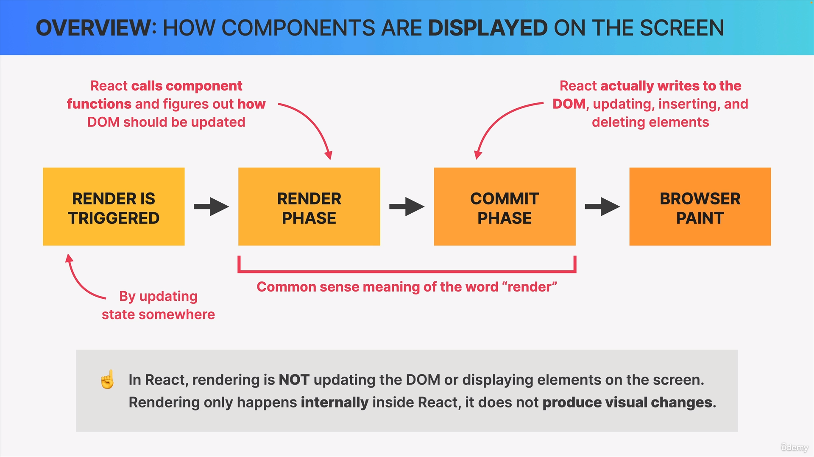
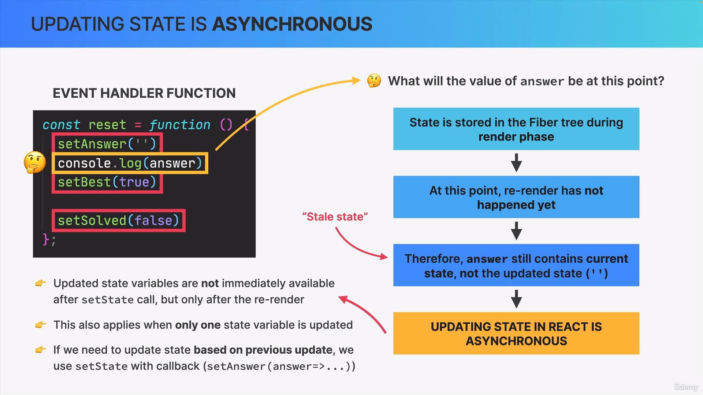

# Udemy--The-ultimate-react-cource-notes

# JS Review:

## Destructuring:

### Destructuring Objects:

- Destructuring object is used to partition the properties from an object with ease. It is very useful for complex object with lot of properties in them.

- For example , let us a take a object a as below:

```js
const a = {
name : 'vijay',
initial : 'S',
age: 22
interests: ['swimming', 'dancing' , 'singing']
}
```

- We can get the required property from the object using period operator as below:

```js
const interests = a.interests; //  ['swimming', 'dancing' , 'singing']
```

- It is okay for small object. What if we have a complex object and want to get the multiple properties from that object. The period operator method is little complext then. But Destructuring allows us to do it in a single line as below example shows:

* If I want to select multiple properties from the object we have created above.

```js
const a = {
name : 'vijay',
initial : 'S',
age: 22
interests: ['swimming', 'dancing' , 'singing']
}

const { initial , age , interests } = a ;    // The variable name must match with the property name in the object.

console.log(initial);    // 'S'
console.log(age);        // 22
conosle.log(interests);  // ['swimming', 'dancing' , 'singing']
```

### Destructuring Array:

- Array destructuring is same as Object Destructuring. Is also helps to partions the array elements with ease.

- Instead of using {} , We should use [] for destructuring arrays.

- Unlike Object Destrcuturing, Array destructuring variables is not dependant on array elements. we can set variable names according to our wish.

```js
const array = [0, 100, 1000];

[singleZeroNumber, doubleZeroNumber, TripleZeroNumber] = array;

console.log(singleZeroNumber); // 0
console.log(doubleZeroNumber); // 100
console.log(TripleZeroNumber); // 1000
```

## Rest and Spread operators:

### Rest operator in Object :

- Rest operator is represented with 3 dots contnued with variable name as : `...variable_name`

- Rest opearator can be only used with destructured object and as a last postion.

- Basically rest operator in a destructured object is used to store the remaining values in that object with a new variable and in the format of seperate object.

* Example:

```js

const a = {
name : 'vijay',
initial : 'S',
age: 22
interests: ['swimming', 'dancing' , 'singing']
}

const { initial , name , ...other_details } = a ;  // ...other_details is the Rest operator

console.log(initial);         // S

console.log(name);            // vijay

console.log(other_details);   // { age: 22 , interests: ['swimming', 'dancing' , 'singing'] }

```

### Rest operator in Array :

- Rest operator in array is also represented with 3 dots contnued with variable name as : `...variable_name`

- Like objects, rest opearator in array can be only used with destructured array at last postion.

- Like objects, Basically rest operator in a destructured array is used to store the remaining values in that array with a new variable and in the format of seperate array.

* Example:

```js
const array = [0, 100, 1000, 11, 22, 36749, 4738, 6, 7];

[singleZeroNumber, doubleZeroNumber, TripleZeroNumber, ...NonZeroNumbers] =
  array; // ...NonZeroNumbers is Rest operator.

console.log(singleZeroNumber); // 0
console.log(doubleZeroNumber); // 100
console.log(TripleZeroNumber); // 1000
console.log(NonZeroNumbers); // [ 11, 22 , 36749, 4738, 6 , 7 ]
```

### Spread operator in Objects:

- spread opearator is also denoted with 3 continuous period follwed by variable name as : `...variable_name`

* Spread operator is used to create new object with the existing object by adding new properties or updating the available properties.

* Example:

```js
const a = {
name : 'vijay',
initial : 'S',
age: 22
interests: ['swimming', 'dancing' , 'singing']
}                                                         // Existing object

const spreaded_A = {
    ...a ,                    // Spread operator which spreads the existing 'a' object
    weight : 60 ,             // Adding new properties to 'a' object
    name: 'Vijay Yesudas'     // Updating the existing 'name' property value of 'a' object to new value
     }


console.log(spreaded_A);  // {
                                name: 'Vijay Yesudas' ,
                                initial : 'S',
                                age: 22,
                                interests: ['swimming', 'dancing' , 'singing'],
                                weight: 60
                                }

```

### Spread operator in Arrays:

- spread operator in array is used to create a new array with the existing array and can add elements as well.

* It is denoted in the similar way that spready operator in objects: `...variable_name`

* Example:

```js
const array = [0, 100, 1000, 11, 22, 36749, 4738, 6, 7];

const spreaded_array = [...array, 666, 69, 96, 99];

console.log(array); // [ 0 , 100 , 1000 , 11, 22 , 36749, 4738, 6 , 7]
console.log(spreaded_array); // [ 0 , 100 , 1000 , 11, 22 , 36749, 4738, 6 , 7 , 666 , 69 , 96, 99 ]
```

# Working with Components, Props and JSX

## Rendering the root component and Strict mode:

- To render a root component in react, we use two importatnt packages as below:

  - react
  - react-dom

- In the src folder, index.js file is the entry point of the react application and root component should be rendered there.
- The react web-packages will look for the `index.js` file to render application.
- In index.js file the whole application can be rendred as below:

```js
import React from "react";
import ReactDOM from "react-dom/client";

function App() {
  return <h1>Hello VIJAY!</h1>;
}

const root = ReactDOM.createRoot(document.getElementById("root")); // The div element is obtained from index.html file in public folder
root.render(
  <React.StrictMode>
    <App />
  </React.StrictMode>
);
```

- strict mode is React's component which allows the component rendreing the two times for easy debuging in development time.

* It is useful to enable stric mode during development by covering the root component within strictmode component as below:

```js
<React.StrictMode>
  <App />
</React.StrictMode>
```

## Styling React components

- React allow mutiple ways to style the application like inline css, external css, tailwind css and etc.

### Inline CSS :

- Normally, we can apply any styles in any element using `style` attribute. Likewise JSX also allows style attribute on elements in a different way.

- We can apply the styles on elemnts by assigning style attribute to the element. And the value for style attribute to be
  format `{{ }}`.

- Because JSX needed to be entered into javascript mode through `{ }` notation and then inside the javascript mode , multiple styles can be applied using another `{}` notation as `{{ ... }}`

- The styles we apply inside javascript block should be camelCased as these styles are belongs to javascript not CSS.

* Example styling :

```js
function Header() {
  return (
    <h1 style={{ color: "red", fontSize: "48px", textTransform: "uppercase" }}>
      {" "}
      // Inline styling in JSX Vijay's Fast Pizzas.Co{" "}
    </h1>
  );
}
```

- We can also define the styles in any variable and use it as below:

```js
function Header() {
  const headerTextStyle = {
    color: "red",
    fontSize: "48px",
    textTransform: "uppercase",
  };
  return <h1 style={headerTextStyle}> Vijay's Fast Pizzas.Co </h1>;
}
```

### External CSS:

- It is usual way of adding styles to website. External css file should be imported in the component file where we want to use the css styles.

* When we use external CSS , we should keep an important note in mind that the class keyword will not apply styles on elements in JSX. Instead the class keyword, we should use `className` in JSX to apply the desired styles we used in external file.

## Passing and receiving Props:

- Props are used to pass data between conponents line parent to child components.

* It is a simple two step process.

* First , we need to set the props as attributes in the child component element as below:

```js
function Menu() {
  return (
    <menu className="menu">
      {" "}
      // Parent component
      <h2>Our Menu</h2>
      <Pizza // Child component
        name="Pizza Spinaci"
        ingredients="Tomato, mozarella, spinach, and ricotta cheese"
        photoName="pizzas/spinaci.jpg"
        price="100.00"
        // Passing data as attributes
      />
    </menu>
  );
}
```

- Secondly, the properties need to be rrceived in the child component as arguments. React automatically converts the attributs from the parent as Object in the child component and we can access the object in the child component using javascript bloks.

```js
function Menu() {
  return (
    <menu className="menu">
      <h2>Our Menu</h2>
      <Pizza
        name="Pizza Spinaci"
        ingredients="Tomato, mozarella, spinach, and ricotta cheese"
        photoName="pizzas/spinaci.jpg"
        price="100.00"
      />
    </menu>
  );
}

function Pizza(props) {
  // Receving props in child component
  console.log("props", props); // {
  name = "Pizza Spinaci";
  ingredients = "Tomato, mozarella, spinach, and ricotta cheese";
  photoName = "pizzas/spinaci.jpg";
  price = "100.00";
}
return (
  <div>
     // Using as js blocks in
    child
    <h3>{props.name}</h3>
    <p>{props.ingredients}</p>
  </div>
);
```

### NOTE:

- If we want to pass a value as a props from parent , we just want to use them inside javascript block.

## props immutability

- As props are just javascript objects,we cannot mutate them in the child component. If we want to change some props in child , then we require the help of state.

- The reason for is that if the any oject is mutated then original object is also gets updated. So, In react the parent component props will also be get updated. It will cause side effects in react components. So, the props are immutable.

## One-way data flow:

- React Strictly follows one way data flow which means data can be passed from parent to children and not viceversa.

- It helps developers to debug data flow as it is uni-directional.

* In some cases, If data is necessary to pass childe from parent React provides another solution to achive that solution.

## Rendering Lists:

- Rendering list is creating dynamic components/ any JSX in view based on the array we have.

* It is literally converting an array to view.

* We should iterate over the array and do the stuff we want. Mostly we will use array.map method to render the list.

* While doing this, we should consider that `key` attribute to be passed definitely which is unique value for each element in the array we render. Otherwise a warning message will be displayed in console.

## Conditional Rendering with &&

- Condiional rendering means rendering some piece of UI ( JSX / Component ) to the view based on some condiion.

* using `&&` operator we can render the templates using shrot circuiting.

* Consider an expression: a && b

* If a is true value, then b is returned. Otherwise nothing will be returned as execution stops at first staement which is a (false) ,and does not see the second one which is b.

* Other than boolean (true/false) , `&&` operator also works for truthy/ falsy values. It works same as true or false value.But while rendering something to view for falsy value other than false like 0, the value will be displayed in view. So , condition should be set according to that.

## React fragments `<> </>`

- React fragments are empty tags which allows to bind multiple elements in JSX.

- Usually while returning JSX, React forces us to combile all the elements under one root element. But in some cases we need to return seperate elements without common root. Here, Fragement helps to acheive that. We can wrap those within fragments which is `<> </>` or `<React.Fragment></React.Fragment>`

* Example:

```js
function Menu() {
  const pizzas = pizzaData;
  // const pizzas = [];

  return (
    <menu className="menu">
      <h2>Our Menu</h2>

      {pizzas.length > 0 ? (
        <>                                // React fragment
          <p>
            Authentic italian cusine.6 creative dishes to choose from. All from
            our stone oven. all organic, all delicious.
          </p>
          <ul className="pizzas">
            {pizzaData.map((pizza) => (
              <Pizza pizzaObject={pizza} key={pizza.name} />
            ))}
          </ul>
        </>                               // React fragment closing tag
      ) : (
        <p>
          We're still working on our Menu. So, please come back after some time
          :)
        </p>
      )}
    </menu>
  );
```

- NOTE : In DOM , the wrapped elements such as <p>..</p> and <ul>..</ul> doesn't have any parent element when we use react fragments.

## State in React

- State is simply the memory of a component.

- State is the data, a component can hold over time which is necessary untill the app's lifecycle.

* A state can be the notification count, active tab information in nav bar , user text in a search bar , content of a shopping cart and etc.

* All state in a component is changable because of user interactions. Like user can navigate to another tab and the active tab needs to be updated, user can change the text typed in search bar and so on.

* The term `state` refers to the components state which is the collection of all single state variables in a component. And the term `Piece of state / state variable` refers to the individual state variable in a component.

* The important thing in state is, When component state is get updated , react re-render the component. Which means whenever a piece of state is updated, User Interface of the component is also updated. When we change state , we change the User Interface.

## Creating a State variable using `useState()`

- `useState()` is a function provided bu react library to handle state varibles in a component.

* We should import the useState() functon from react library to use it in component.

* useState() function requires an argument. The argument should be the intial value of a state. It may of any type.

* The useState() function returns an array with two elemnts.

  - The first one is the initail value we passed as argument.
  - The second one is the function which is used to update the state value.

* As the useState() method returns an array, We can simply assign the value to the new array and destructue it with the desired variables to use them in our components as below:

* For Example , If I want to create a state for variable step with initail value 1, I must do as below:

```js
const [step, setStep] = useState(1);
```

- We can update the step value by passing the value to update to the setStep function whereever we need to update and UI will change according to it.

```js
const [step, setStep] = useState(1);

function handleNext() {
  setStep(step + 2); // Updating step state
}
```

### Importatnt things on State:

- As `useState()` is a react hook, we cannot call it in any other functions / blocks . We should only define the useState() hook in the top of the Component.

```js

function App(){

const [ step , setStep ] = useState(1);            // It is correct
.
.
.

if(true){
const [ step , setStep ] = useState(1);            // It is not possible;
}

function handleNext(){
  ...
const [ step , setStep ] = useState(1);            // It is not possible;
}

}
```

- We can only update the staet using function returned by the useState() function not manuallly.

### Updating state based on Current State

- Updating state using setter function is common and we can call that setter function with new value as argument and state get changed.

- If the new value is based on the current value, then we need to pass an call back function as an argument instead of passing just the new value to setter function. The callback function is having the current value of the state as parameter and we can update that according to our requirment.

- If the new state is not dependant on current state value, then no need of call back function method. We can simply pass the new value as argument to the setter function.

```js

export default function App() {
  const [step, setStep] = useState(1);
  const [displaySteps, setDisplayStpes] = useState(true);

  function handlePrevious() {
    if (step > 1) {
      // setStep(step - 1);                                  // Normal update
      setStep((currentStepValue) => currentStepValue - 1);   // updating state based on current value(call back function method)
    }
  }

  function handleNext() {
    if (step < 3) {
      // setStep(step + 1);
      setStep((currentStepValue) => currentStepValue + 1);
    }

    .
    .
    .

  }

}
```

## Controllled Elements

- usually the elements like input field, select box and something else we mostly use in forms will maintain their own state(Value) in DOM. But, the values must be available together in our react application to use them. To achieve this, we use Controlled elements in react.

### Steps to implement controlled elements:

- Step 1: Creat state.
- Step 2: Add value property to the element which we want to controland assign the value to the state variable we created in first step.
- Step 3: Add onChange property to the same element and assign the event handler function with the setState function we created in first step. Set the value as `event.target.value` in setState method which is returned by the onChange event handler to synchronous with the value.

```js
function Form() {
  const [quantity, setQuantity] = useState(1);
  const [description, setDescription] = useState(""); // Step 1

  function handleSubmit(e) {
    e.preventDefault();

    if (!description) return;

    const newItem = {
      id: new Date(),
      description,
      quantity,
      packed: false,
    };

    console.log("new item", newItem);

    setQuantity(1);
    setDescription("");
  }

  return (
    <form className="add-form" onSubmit={handleSubmit}>
      <h3> What do you need for your 😍 trip ?</h3>
      <select
        value={quantity}
        onChange={(event) => setQuantity(Number(event.target.value))}
      >
        {Array.from({ length: 20 }, (_, i) => i + 1).map((num) => (
          <option key={num} value={num}>
            {num}
          </option>
        ))}
      </select>
      <input
        type="text"
        placeholder="Enter Item..."
        value={description} // Step 2
        onChange={(event) => setDescription(event.target.value)}
      />{" "}
      // Step 3<button>Add</button>
    </form>
  );
}
```

## Difference between State and Props in React:

- Data : States are internal data which means state data is owned by the component itself. In the otherhand Props are external data which means the Props data is owned by the parent component.

- Like : States can be thought of component memory as it holds the component's data overtime across multiple rerenderings and Props can be thought of function parameters which carries the parent component data to children components.

- Updating : States can be updated by the components itself on the other hand Props can not be changed in the receiving component ( read-only)

- Re-rendering while update : While State get updated, the component get re-rendered. Receving new props causes the component to re-render. Which means, whenever the parent component where the props are received is get updated the parent componet will re-render and the child components of that parent also re-renders then if any props are sent from parent to child then it will be updated with the re-render.

- Usage : States are used to make the component interactive. Props are used by the paraent component to configure the child component

## Section-7 Thinking in React

### Fundamentals of State Management

### What is State management?

- State management is simply deciding When to create pieces of state, What types of states are necessary , Where to place each pieces of state and how data flow throughout the app.

### Types of State:

- In React each piece of state is only belongs to the two types as below:

  - Local state.
  - Global state.


### When and Where to use State ?


### Lifting state up:

- When we need to maintain state in common for two sibiling component , it should be maintained in first parent component of both the sibiling components.

* Example:

* Consider we have component structure as below:

* App component has two children. One component has a button which simply updates a state to randpm numbers. But we need to display the number in another component which is child-2.

```js
function App(){
  return (
    <div>
    < Child-1/>
    < Child-2 />
    </div>
  )
}


function Child-1(){

  const [state1 , setState1 ] = useState();

  function updatetState(){
    setState1(Math.random())
  }

  return (
    <div>
  <button
  onClick={updateState} > Click to update state1 in Child-2 Component </button>
  </div>
  )

}

function Child-2(){

  return <h1> I am Child-2 and have to display the value from Child-1.</h1>
}


```

- So we cannot pass the state to the Child-2 directly as it is not the children for Child-1. But we can achieve this by lifting up the state to the first parent compoent of both sibiling components. In this case it is App Component.

- So, If we move the state to App, then we can pass the state as props to the Child-2 component and also the SetState function as props to the Child-1 property.

```js

function App(){


  const [state1 , setState1 ] = useState();        // Moved state to parent component

  function updatetState(){
    setState1(Math.random())
  }


  return (
    <div>
    < Child-1  onButtonClick={ updateState } />     // Pass the updateState function to Child-1 as params
    < Child-2  stateValue={ state1 } />             // Pass the state1 state to Child-2 as params
    </div>
  )
}


function Child-1({ onButtonClick }){           // Receiving props from App

  function handleButtonClick(){
      onButtonClick()                           // Calling the function in App component
  }

  return (
    <div>
  <button
  onClick={ handleButtonClick } > Click to update state1 in Child-2 Component </button>
  </div>
  )

}

function Child-2({ stateValue }){              // Receiving props from App

  return <h1> I am Child-2 and have to display the value from Child-1. { stateValue }</h1>     // Using State from App
}

```

### Examples:


## Deriving State:


## The Children Prop

- The children prop is the main and fundamental technique or method in react.

- We usully use define the component and use that component in jSX as an element only with the closing tag not in usual opening and closing tag method.

- But, the truth is react also allows the both methods which means instead of using only the closing tag to use the component we can use the opening and closing tag fot that component as below example.

```js
function App() {
  return (
    <div>
      <Button /> // USUAL METHOD ( Closign tag )<Button></Button> // CHILDREN PROP
      METHOD ( Opening and closign tag )
    </div>
  );
}

function Button() {
  // Component
  return <Button>I am Button Component</Button>;
}
```

- The important thing should consider while using the second method is react allows the default `children` prop to that component and the children props value is the value in inbetween the opening and closign tag of the component.

```js
function App(){
  return (
    <div>
    <Button />                                                          // USUAL METHOD ( Closign tag )
    <Button> HI I AM CHILDREN PROP VALUE </Button>                     // CHILDREN PROP METHOD ( Opening and closign tag )
    </div>
  )
}

function Button({ children }){                        // Component --> children props
  return (
    <Button>
      I am Button Component.
      <span> {children  } </span>                     // Using children props in JSX
    </Button>
  )
}


OUTPUT BUTTON WILL LOOK LIKE BELOW:


------------------------------------------------------
|                                                     |
| I am Button Component. HI I AM CHILDREN PROP VALUE  |
|                                                     |
------------------------------------------------------
```

- So, Children prop is a default props provided by react which rendres the value between the opening and closing tag into components.

<br>

<br>

<br><br><br>

#####################################

# Tanstack-react-query package:

## Overview:

- This tanstack-react-query is also known as 'react-query' which is helpful in fetching , caching , synchronising and updating server state in web-applications.

## Installation:

- Installation command :

```js
npm i npm i @tanstack/react-query

```

- Install react-query devtools using below command:

```js
npm i @tanstack/react-query-devtools

```

## provider setup:

- First we should wrap the section where we should use react-query with `Provider`.
- Mostly we will use the react-query for entire application.
- So we can wrap the App component with ` QueryClientProvider` from tanstack-react-query library.

* For that we should import `QueryClient` and `QueryClientProvider` from `@tanstack/react-query`.
* We should wrap the App component seector between the `<QueryClientProvider> selector`.
* `QueryClient` is the actual client we should create and should register with QueryClientProvider as a props. Then the whole application will be registered with the queryClient we created.

### tanstack-react-query --> index.js

```js
import React from "react";
import ReactDOM from "react-dom/client";
import App from "./App";
import { QueryClient, QueryClientProvider } from "@tanstack/react-query";

const root = ReactDOM.createRoot(document.getElementById("root"));

const queryClient = new QueryClient(); // we can pass the default value to the querClient inside parenthesis ().

root.render(
  <React.StrictMode>
    <QueryClientProvider client={queryClient}>
      {" "}
      {/*  Registering QueryClient with QueryClientprovider */}
      <App />
    </QueryClientProvider>
  </React.StrictMode>
);
```

## Basic Example:

- With react-query, we can mainly do two basic things as below:

  - 1.  `query` which means getting data from somewhere.
  - 2.  `mutation` which means changing some type of data.

* tanstack react query package provides two custom hooks to achiev the above mention actions. They are :

  - 1.  useQuery()
  - 2. useMutation()

### useQuery():

- useQuery() hook allow us to get data.
- useQuery() takes an object as argument.
- The object can accept list of properties but the main two properties we should mainly consider are:

  - 1. `queryKey` --> It accepts the array which should contain `unique` value that represents the query.
  - 2. `queryFn` --> It accepts the value of a asynchronous function which returs a Promise.

* Once the useQuery() hook is provided with the object with the above mentioned properties, it should be defined to a variable.

* The variable which have the useQuery({...}) hook is now have access for multiple methods in the asynchronous operation like isLoading , isError and so on.

* So now using the variable which sets with the value of useQuery({...}) hook we can update the UI / do some other thing in our application like error handling , loading indications , success responses ,error responses and o on.

### useMutation():

- useMutation() hook is allow us to update the data.
- As useQuery() hook it also takes an object as argument.
- The object accepts the `mutationFn` as a main property and it allows the asynchrounous function as a value to update the data.

* Ths Mutation function accepts an argument with any type which is the actual value need to be get updated.

* Once we defined the useMutation({ ... }) hook with a variable, we can call `mutate()` method and pass the required value to update as an argument to that method.
* This only will not update the value. There is a another method available called `onSuccess` in the MutationFn .
* Before proceeding this,we must import `useQueryClient` hook from tanstack/query-client.
* In that, we should call `invalidateQueries()` function and pass the argument of `queryKey` which query we want to mutate.

### tanstack-react-query ---> App.js:

```js
import { useMutation, useQuery, useQueryClient } from "@tanstack/react-query"; // importing useQuery

const POSTS = [
  { id: 1, title: "Post 1" },
  { id: 2, title: "Post 2" },
];

function App() {
  const queryClient = useQueryClient();

  const postsQuery = useQuery({
    // Assinging queryKey({...}) hook witht the variable
    queryKey: ["Posts"], // Assinging querykey
    queryFn: () => wait(1000).then(() => [...POSTS]), // Assing queryFn with th easynchronous function.
    // queryFn: ()=> Promise.reject("Error Ocuured!")            // Faking an Error to test for isError functionality
  });
  console.log("mutation", POSTS);

  // Defining a mutation function

  const newPosMutation = useMutation({
    mutationFn: (title) => {
      return wait(1000).then(() =>
        POSTS.push({ id: crypto.randomUUID(), title })
      );
    },
    onSuccess: () => queryClient.invalidateQueries(["Posts"]), // Invalidating queryClient on Success
  });

  if (postsQuery.isLoading) return <h1>Loading...</h1>; // Accessing isLoading method using queryClient variable and handling UI.

  if (postsQuery.isError) {
    return <h1>{JSON.stringify(postsQuery.error)}</h1>;
  }

  return (
    <div className="App">
      {postsQuery.data.map((post) => (
        <p key={post.id}>{post.title}</p>
      ))}
      <button
        disabled={newPosMutation.isPending}
        onClick={() => newPosMutation.mutate("NEW POST")}
      >
        Add Item
      </button> {/* Calling mutation method */}
    </div>
  );
}

function wait(duration) {
  return new Promise((resolve) => setTimeout(resolve, duration));
}

export default App;
```

# PART 2

## section: 10 Thinking in React : Components , composition and reusability.

### Splitting UI into components:

- Component size matters. We should generally go for intermediate size components. Component should not be too large or too small.


### Component categories:


### Component composition:


### Alternative way of component composition without using children props:

- In react , we can also utilize component composition without children prop. We can use any explicit prop with any name we want to acheive the component composition.

* First we need to use the component as we usually do ( < ComponentName /> ).
* Pass the props with the desired name ( < ComponentName propName={...} /> ).
* The prop value should be the JSX / code we actually need to pass ( < ComponentName propName={ any JSX / code } /> ).
* The prop should be recived in the component and to be used in the desired place. ( function ComponentName({propName}) { .. use propName } )

```js
function Demo() {
  return (
    <>
      <Button explicitProp={<span> Click me ! </span>} /> // Passing explict
      prop with desired prop name.
      <Button explicitProp={<h1> BIG CLICK ME !</h1>} /> // Reusing the component
      with another prop value
    </>
  );
}

function Button({ explicitProp }) {
  // Receiving prop
  return <button> explicitProp </button>; // Using the prop
}
```

### Props as API's:


### Prop Types with prop-types:

- prop-types is the library which imported with the react and we can use this to define the type of props in any component.

* In the top of component file we should import , "prop-types" librarry with desired name we want.

* And then before the component function get's starts, we should call the propTypes method in the component and assign the value as object with property name and the type.

### Example :

```js

import PropType from "prop-types"

...
StarRating.propTypes = {
    maxStarCount: PropType.number,
    color: PropType.string,
    size: PropType.number,
    className: PropType.string,
    messages: PropType.array,
    defaultRating: PropType.number,
    onUpdateRating:PropType.func
}

export default function StarRating(
    {
        maxStarCount = 5,
        color = "#fcc419",
        size = 48,
        className = "",
        messages = [],
        defaultRating = 0,
        onUpdateRating
    } ){
    .
    .

    }

```

- After defining the type in the component , the component consumner can not pass different type of props to this component. Is so , the warning will be thrown in the console for debugging.

- We can use Typescript instead of js to handle it without prop-types library.

## How React works behind the scenes ?

## Components, Component instances and React elements:

<h1>Components:</h1>

 <br><br>

<h1>Components instances:</h1>


- For example, when we console any instance of a component we , amy get a object as below:

* Consoling the component instance as below:

```js
console.log(<App />); //
```

- Result:


- The above object is the `React component`. The type property holds the name of the component and props holds the properties of a component if any.

- The `$$typeof : Symbol(react.element)` property is the default for any react element which is added for a seurity reasons to avoid Invalid React element in the DOM by external people.


## How Rendering works ?

<h1> Component to UI (User Interface) flow reacp </h1>


<h1> Overview of How components displayed to Screen </h1>



<h1> 1) --> How Render is trigerred ?</h1>


<h1> 2) --> The Render phase  </h1>

<h2> The Overview of Render Phase </h2>


<h2> What is Virtual DOM ? </h2>


<h2> What is Reconcilation and Why it is needed ? </h2>


<h2> The Fiber : Reconciler </h2>


<h2> Reconcilation in action </h2>


<h1> 3 and 4)  --> The Commit phase & Browser Paint </h1>

<h2> Overview of commit phase and browser paint phase </h2>


<h2> React_library and Renderers </h2>


<h1> Recap of how React works ? </h1>


<h1> Diffing </h1>

<h2> What is Diffing ? </h2>


<h2> Diffing works for Same Position Different Element RULE </h2>


<h2> Diffing works for Same Position Same Element RULE </h2>


<h1> The Key Prop </h1>

<h2> What is Key prop ? </h2>


<h2> Keys in List [Stable key ] </h2>


<h2> Key props to reset state [ Changing key ] </h2>


<h1> Rules for Render Logic </h1>

<h2> The Two types of logic in react component </h2>


<h2> Functional programming principles </h2>


<h2> Rules for Render logic </h2>


<h1> State update batching </h1>

<h2>How State updates are batched ?</h2>


<h2> How NOT React updates multiple pices of state ?</h2>


<h2> How react updates multiple pieces of state ?</h2>


<h2>Updating state is Asynchronous </h2>


<h2> Batching beyond the Event handler functions </h2>


<h1> How events work in React ? </h1>

<h2> Event propogation and delegation </h2>


<h2> How react handles Event ?</h2>


<h2>Synthtic Events </h2>

x
<h1>Frameworks VS Libraries</h1>


<h1>React - library ecosystem</h1>


<h1> Frameworks built on react library</h1>


<h1>Summary of how React works section </h1>


<h1> Effects and Data fetching </h1>

<h2>Component (instance) Lifecycle <h2>


<h2> How NOT to fetch data in React </h2>

- As we saw already we should fetch external data in the renderig ohase of a component ( Know about renderig phase in "Rules for Render logic topic)

- If we do, the API you are accessing willbe called multiple time in a loop which is very worse and can crash the application.

- So we should not call any API ( fetch exteral data ) in the render phase of the application like below:

```js
export default function App() {
  const [movies, setMovies] = useState(tempMovieData);
  const [watched, setWatched] = useState(tempWatchedData);

  // DO NOT CALL API IMMEDIATELY AS BELOW  and UPDATE STATE THERE

  fetch(`http://www.omdbapi.com/?apikey=${KEY}&s=interstellar`).
    then(res => res.json()).
    then(data => setMovies(data))

    return (
      <>
        <Navbar>
    )
}
```

<h2> USE useEffect hook to load external data as below </h2>

- Instead of directy loading data in rendering phase , use useEffect a react hook to load the data.

- useEffect hook takes two arguments baically. One is function to execute in the hook and second one is the dependancy array.

- Passing empty array as second argument to useEffect hook will trigger the function only on MOUNT lifecycle of the component.

- This will not create any infinite loop for API call.

```js
// CORRDCT WAY
useEffect(function () {
  fetch(`http://www.omdbapi.com/?apikey=${KEY}&s=interstellar`)
    .then((res) => res.json())
    .then(
      (data) => setMovies(data.Search)
      // console.log("data",data.Search)
    );
}, []);

// WRONG WAY
fetch(`http://www.omdbapi.com/?apikey=${KEY}&s=interstellar`)
  .then((res) => res.json())
  .then(
    (data) => setMovies(data.Search)
    // console.log("data",data.Search)
  );
```

<h1> Effects - Introduction  </h1>

<h2> Where to create side effects </h2>


<h2> Event handlers vs Side effects </h2>


<h1> Using async functions in useEffects hook </h1>

- As we already know useEffect hook will receive functon as first argument. If we want to pass the `async` function as a first argument to the hook, It is not possible.

* So to utilize the async functions inside the useEffect hook, we must use a oridinary function as first argument and inside the function we must define our required aync function and then call that function too to make it work as weexpected.

```js
useEffect(
  // 1st argument  : Function which has side effects
  function () {
    // Defining async function inside useEffect function
    async function FetchMovies() {
      const res = await fetch(
        `http://www.omdbapi.com/?apikey=${KEY}&s=interstellar`
      );
      const data = await res.json();
      setMovies(data.Search);
    }

    // Calling the defined async function inside the useEffect hook function itself to execute the async function
    FetchMovies();
  },
  // 2nd argument : Dependency array
  []
);
```

<h2> useEffect dependancy Array </h2>


<h2> Use Effect SYNCHRONIZATION machanism </h2>


<h2>Synchronization And lifecycle </h2>


<h2>When are effects executed ?</h2>


<h2> The clean up function </h2>


NOTE : Even though, the clean up functon is executed after the component unmounted, It can still access the state values in cleanup function because of closure concept in javascript.

<h2> Clean up Data fetching</h2>

* In applications, when we call Fetch API's rapidly one by one, it will cause race conditions which means API's get called very fast one by one and every of them get downloaded in browser but we actually don't want all of them.

* For example , In usePopcorn application, When we search for movies we call fetch API to get movies list in API component , the fetch API is getting called rapidly one by one and creates race condition.


* In order to fix this issue, we need to cleanup the fetch API if next request is started. So that the we can only get the latest response.

* To do this we just need to use `AbortController` webAPI as below:

* First step, we need to define the instance of controller as below:

```javascript

useEffect( function(){
  const controller = new abortController();

  // remaining

} ,[state])


```
* Next we should use this controller in fetch API by passing this in fetch API body as below:

```javascript

useEffect( function(){

const controller = new abortController();

// remaining code ... 

fetch( `API` , { 
  signal: controller.signal
})

//... 

} ,[state])


```

* Next we should call the abort function of the controller in cleanup function in useEffecthook as below:

```javascript

useEffect( function(){

const controller = new abortController();

// remaining code ... 

fetch( `API` , { 
  signal: controller.signal
})

//... 

return function(){
  controller.abort();
}

} ,[state])

```

* Now, the controller will abort the fetch request when a new one get triggered but it will cause error and captured in error block with the error name `AbortError`. So to get the result we need to avoild the AbortError in catchblock as below:

```javascript

useEffect( function(){

const controller = new abortController();

// remaining code ... 

try{
  fetch( `API` , { 
    signal: controller.signal
  })
}
catch(error){ 

  // Handling AbortError

if(error.name !== 'AbortError'){
  setError(error.message)
}
}

//... 

return function(){
  controller.abort();
}

} ,[state])

```

# Custom Hooks

# React hooks and and their rules:


# Overview of built-in hooks:


# The Rules of hooks:


## Hooks rely on call order -1 :


# More details of useState() hook :

## Initializing state with a callback ( Lazy initial state )

* We can simply pass a function as initial value for an useState hook. 

* When we initialize a state using ueeState() hook and we can set inital value for the state inside the curly bracs as `useState(initial value)`.

* Instead of passing a value directly inside the curly bracs we can also pass a function which return the inital value we want as below

```javascript
const [ demo , setDemo ] = useState( function(){
  return JSON.parse(ocalStorage.getItem('watched'));
});
```

* The above state declaration is having initial value from localStorage.

## useState Summary :


# How NOT to select DOM elements in react :

* We should not select DOM elements mannually in React like document.querySelector method even though it works as expected.

* For example in usepopcorn application if we want to implement auto focus in Search component when application mounts we can do that as below:

```javascript

function Search(){
  // Even though it works as expected We should NOT DO THIS
  useEffect(function(){
    const searchElment = document.querySelector('.search');
    searchElement.focus();
  } ,[])

  return <></>
}

```

* The above code mannually selected DOM element and updates it. But in react We shoud not do this instead we should `useRef` hook which react library provides.

# UseRef hook introduction:

## What are Refs? :


## Difference between State and Ref :


## UseRef hooks to Select DOM elements:

* Using a ref with the DOM element invlovs three steps.

### Step 1: Creating Ref

  * First step is to create ref variable using `userRef()` hook. 

  * For that we should import useRef hook from reaact library as we do for useState hook.

  * Next we should create hook like `useRef()` and inside the curly bracs we should pass the initial value and for the DOM element selectd initial value will be `null` in most cases.

  * Next we should assign this hook to some variable. As useRef() hook returns simply a `ref` , it will get assigned to the created variable.

  ```javascript

  import { useRef } from 'react';

  const inputEl = useRef(null);   // Creating Ref

  ```

### Step 2 : Connecting created Ref in element we want to select

* In second step, we should use this created ref variable in the element we want to select.

* In the desired element we must add `ref` property and assign the value. The value should be the created ref variable in first step.

* If We want to select an INPUT DOM element, we should do as below:  

```javascript

import { useRef } from 'react';

  const inputEl = useRef(null); // Creating Ref


  <input
  type="text"
  placeholder="Search"
  ref={ inputEl }               // Using Ref 
  />

```

* Now the the input element is connected with the ref variable. We can accss the ref variable instead of selecting the DOM element by querySelector method.

### Step 3 : Using the Ref :

* Now as third step, we should use the ref.

* We can only use the ref which has the DOM element inside `useEffect()` hook as both the DOM element and useEffect hook are available after DOM fully loaded.

* Now We can perform any operations on that element using the ref.

* To access the direct element we should access the `current` property of the ref. Usually `current` property stores the value of the ref.

```javascript

 const inputEl = useRef(null); // Creating Ref


 useEffect(function(){
   inputEl.current.focus();            // Using ref to access DOM element inside useEffect hook
 },[])


  <input
  type="text"
  placeholder="Search"
  ref={ inputEl }               // Using Ref 
  />

```

# Refs to persist data between renders

* Apart from Selecting DOM elements, refs are used as a variables whose values need to be persited across re-renders ( last value not get changed ).

* Ref variables also do not re-render the application when it get updated but state variables cause re-render.

* Mostly we will use this type of useRef variables to store background values of an application like storing timestampt values to stop timers and so on. Because those values are not meant to displayed to user. 

* If any value is needed to displayed, we want to use `state` because if that variable gets updated re-render will happen and updated value will be displayed. But when we use `ref` variables , if we update them re-render won't happen. So, the updated value will not be displayed to user even if it gets updated.

```javascript
  // Creating Ref variable
  const countRef = useRef(0);

  // updating Ref variable in useEffect  ( Because we are not allowed to update refs in render logic. So we should use useEffect )
  useEffect(function(){
    if(userRating) countRef.current++;
  },[userRating])
```

# Custom hooks :

* Custom hooks is all about reusablity. Custom hooks are simple javascript function which contains one or more hooks inside it. The custom hook functions are reusable as normal functions.

## When to use custom hooks:


## useMovies Custom hook :

* In `usePopcorn` application App component, we have fetchMovies logic inside `useEffect` hook which is responsible for fetching the movie information from API. As this logic is non-visual logic we can take this and turn into a custom hook called `useMovies()`.

* So, For that first I created a new file name `useMovies.js` in usepopcorn project.

* As we already know, custom hooks are simple javascript functions, I creatd a `useMovies` function inside useMovies.js file to make the function act as a custom hook.

* Then I need to transfer the code from the App component to useMovies() hook. So I copied the below code from app-v2.js and pasted inside the function useMovies() in useMovies.js file :

### app-v2.js :

```javascript

    useEffect(
        function () {
    
          const controller = new AbortController();
    
          async function FetchMovies() {
            try {
              setIsloading(true);
              setError("");
              const res = await fetch(
                `http://www.omdbapi.com/?apikey=${KEY}&s=${query}`,
                { signal: controller.signal }
              );
    
              if (!res.ok) {
                const errorMessage = "Something went wrong fetching movies";
                setError(errorMessage);
                // throw new Error(errorMessage)
                return;
              }
    
              const data = await res.json();
    
              if (data.Response === "False") {
                const errorMessage = "Movie not found";
                setError(errorMessage);
                return;
                // throw new Error("Movie not found")
              }
    
              setMovies(data.Search);
              setError("");
            } catch (err) {
              if(err.name !== 'AbortError'){
                setError(err.message);
              }
            } finally {
              setIsloading(false);
            }
          }
    
          if (query.length < 3) {
            setError("");
            setMovies([]);
            return;
          }
          FetchMovies();
    
          return function(){
            controller.abort();
          }
        },
        [query]
      );


```

* And I transfered required states and variables between app-v2.js file and useMovies.js file.

* The updated code of useMovies.js is as below:

```javascript
import { useEffect , useState } from "react";
import { tempMovieData } from './constants'
import { KEY } from './constants';

export function useMovies(query){

    const [movies, setMovies] = useState(tempMovieData);
    const [isLoading, setIsloading] = useState(false);
    const [error, setError] = useState("");
    

    useEffect(
        function () {
          const controller = new AbortController();
          async function FetchMovies() {
            try {
              setIsloading(true);
              setError("");
              const res = await fetch(
                `http://www.omdbapi.com/?apikey=${KEY}&s=${query}`,
                { signal: controller.signal }
              );
    
              if (!res.ok) {
                const errorMessage = "Something went wrong fetching movies";
                setError(errorMessage);
                // throw new Error(errorMessage)
                return;
              }
    
              const data = await res.json();
    
              if (data.Response === "False") {
                const errorMessage = "Movie not found";
                setError(errorMessage);
                return;
                // throw new Error("Movie not found")
              }
    
              setMovies(data.Search);
              setError("");
            } catch (err) {
              if(err.name !== 'AbortError'){
                setError(err.message);
              }
            } finally {
              setIsloading(false);
            }
          }
    
          if (query.length < 3) {
            setError("");
            setMovies([]);
            return;
          }
          FetchMovies();
    
          return function(){
            controller.abort();
          }
        },
        [query]
      );

      return {
        movies,isLoading,error
      }

}
```

* I have returned an object which consisits movies,isLoading, error state variables which are required for JSX in app component.

* And It is consumed app component as below:

### app-v2.js :

```javascript

import { useEffect, useState , useRef} from "react";
import StarRating from "./StarRating";
import { useMovies } from "./useMovies";
import { KEY } from './constants';

export default function App() {
  const [query, setQuery] = useState("");

  // consuming useMovies hook
  const { movies , isLoading , error } = useMovies(query);

 ....
}
```